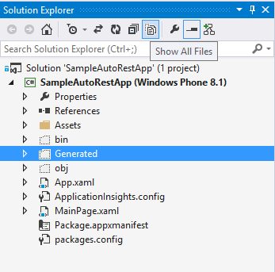
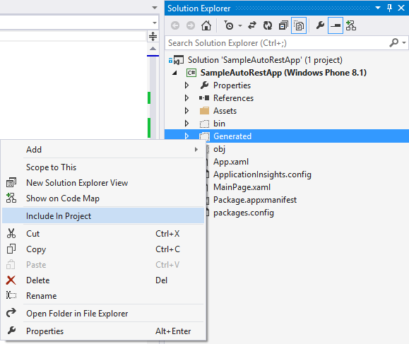

# Project Setup
The C# code generated by C# can be included in multiple Visual Studio project types:

  * Desktop applications (.NET 4.0 and .NET 4.5)
  * Web applications (.NET 4.0 and .NET 4.5)
  * Windows Phone (8.1)
  * Windows Store App (8.1)
  * Portable Class Libraries

###Add Generated Files to the Project 
After generating code into an existing project directory, open the Solution Explorer tab in Visual Studio and click the "Show All Files" button to make the files that are not part of the project visible.


Right-click on the `Generated` folder and select `Include In Project` from the context menu.


###Add the ClientRuntime nuget Package
AutoRest generates code that depends on the *Microsoft.Rest.ClientRuntime* nuget package. This package includes a dependency on *Newtonsoft.Json.Net*. Depending on your project profile, nuget may pull down several additional packages dependencies.

Use the Package Manager UI to add *Microsoft.Rest.ClientRuntime*.


Or install using the Package Manager Console.
```bash
PM>Install-Package Microsoft.Rest.ClientRuntime
```

###Use the Client:
```csharp
var client = new SwaggerPetstore();
Pet myPet = client.FindPetById(10);
```
