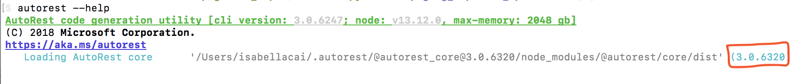

#  Installing AutoRest

Installing AutoRest on Windows, MacOS or Linux involves two steps:

1. **Install [Node.js](https://nodejs.org/en/)** (12.19.x LTS preferred. May not function with Node < 10.x.)

   > if you want an easy way to install and update Node, I recommend [NVS - Node Version Switcher](./installing-via-nvs.md) or [NVM - Node Version Manager](./installing-via-nvm.md)

2. **Install AutoRest** using `npm`

```powershell
# Depending on your configuration you may need to be elevated or root to run this. (on OSX/Linux use 'sudo' )
npm install -g autorest

# run using command 'autorest' to check if installation worked
autorest --help
```

3. To confirm you are using AutoRest V3, and not an older version, run `autorest --help`, and confirm your core version is 3.0 and higher.
   We strongly recommend version `3.06318` or higher due to bug fixes. For more versioning information, see [here][autorest_versioning].

# 

4. If you're running into issues running AutoRest, check out our [troubleshooting][troubleshooting] docs

### Updating AutoRest

To update AutoRest if you have previous versions installed, please run:

```powershell
autorest --latest
```

or

```powershell
# Removes all other versions and plugins and installs the latest autorest-core
autorest --reset
```

For more information, run `autorest --help`

### Not Recommended: Reverting to AutoRest V2

If you must fall back to AutoRest V2, run

```powershell
  # install the previous stable package from npm
  npm install -g autorest@previous

  # run using command 'autorest' to check if installation worked
  autorest --help
```

<!-- LINKS -->

[troubleshooting]: ../troubleshooting.md#module-errors
[autorest_versioning]: ./autorest-versioning.md
