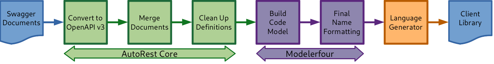

#  Introduction to AutoRest

The **AutoRest** tool generates client libraries for accessing RESTful web services. Input to _AutoRest_ is a spec that describes the REST API using the [OpenAPI Specification](https://github.com/OAI/OpenAPI-Specification) format.
Here we go into some of the general terms you'll see when going through our documentation and interacting with AutoRests.

## What is OpenAPI?

OpenAPI is a specification language used to describe a web service API in terms of its operations and the data types it understands. It was originally conceived as a specification called **Swagger**, so you commonly see these two terms used interchangeably.

OpenAPI is primarily concerned with describing web services that follow the [Representational State Transfer (REST)][rest] architectural model where operations are exposed via URI paths that accept HTTP verbs like GET, PUT, POST, and DELETE. These URI paths generally refer to “resources” understood by the service where the request and response bodies of most operations contain the details of the resource at that path. For example, a POST request with the body containing the desired state of a resource will create that resource, a PUT request with changes to some properties will update the resource, and a DELETE request will cause the resource to be deleted. OpenAPI provides a schema language which enables this type of API to be described in a machine-readable form, usually encoded in JSON.

The main [swagger docs][swagger_basic_structure] have a good example for the basic structure. For more information on how to write an OpenAPI definition for your service, feel free to refer to the [main swagger docs][swagger_docs] or [our own documentation][openapi_docs] for more AutoRest-specific information.

## What is AutoRest?

AutoRest is a tool that provides a code generation framework for converting OpenAPI 2.0 and 3.0 specifications into client libraries for the services described by those specifications. It was developed by Microsoft around the time the OpenAPI Initiative was formed so that Azure service teams could start producing generated client libraries from new Swagger and OpenAPI 2.0 specifications. AutoRest has created a [few extensions][extensions] to augment swagger functionality (a lot were created due to OpenAPI2 shortcomings).

At the core of AutoRest is a flexible pipeline where a series of pre-configured phases transform and merge various OpenAPI input files to produce a “code model” that can be consumed by a language-specific code generator. These code generator extensions will interpret the code model and produce code that aligns with the design guidelines for each language. The generated code for a language will use the corresponding Azure Core implementation so that we can provide configurable behavior for how HTTP requests are made in the generated code.

# 

See our [landing page][landing_page] to get started with writing your OpenAPI definitions and generating with AutoRest!

<!--LINKS-->

[rest]: https://en.wikipedia.org/wiki/Representational_state_transfer
[swagger_basic_structure]: https://swagger.io/docs/specification/basic-structure/
[swagger_docs]: https://swagger.io/docs/
[openapi_docs]: ./openapi/readme.md
[landing_page]: readme.md
[extensions]: extensions/readme.md
