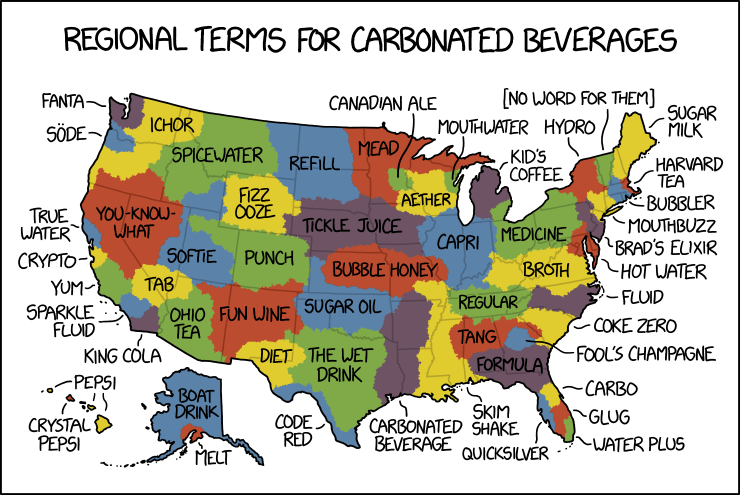

# AutoRest PowerShell Generator - Sample Usage (XKCD)

### Example: XKCD

Download the [XKCD swagger](https://raw.githubusercontent.com/Azure/autorest/master/docs/powershell/samples/xkcd/xkcd.yaml) file.

> `iwr https://raw.githubusercontent.com/Azure/autorest/master/docs/powershell/samples/xkcd/xkcd.yaml -outfile xkcd.yaml`

Then run AutoRest PowerShell:

> `autorest --powershell --input-file:./xkcd.yaml `


```  text
AutoRest code generation utility [version: 3.0.5135; node: v10.15.0]
(C) 2018 Microsoft Corporation.
https://aka.ms/autorest
   Loading AutoRest core      'C:\Users\garretts.NTDEV\.autorest\@microsoft.azure_autorest-core@3.0.5330\node_modules\@microsoft.azure\autorest-core\dist' (3.0.5330)
   Installing AutoRest extension '@microsoft.azure/autorest.powershell' (beta)
   Installing AutoRest extension '@microsoft.azure/autorest.remodeler' (beta)
   Installing AutoRest extension '@microsoft.azure/autorest.csharp-v2' (beta)

>
```

The generator will create a `./generated` folder where the files will be

Inside that, you'll find a `build-module.ps1` script that will compile up the module.

If you add `-Run` to the `build-module` script, it will launch a new instance of `pwsh` and load the module so you can test it.

> `./generated/build-module.ps1 -Run`

``` text
Spawning in isolated process.
Cleaning folders...
Compiling private module code
Private Module loaded (C:\...\generated\bin\XKCD.private.dll).
Processing cmdlet variants
Generating unified cmdlet proxies
Done.
-------------------------------
PS C:\...\generated [ testing XKCD ] >

```

Now you can try out the cmdlets that have been generated:

List the commands from the module:

> `get-command -module XKCD`

``` powershell
CommandType     Name                                               Version    Source
-----------     ----                                               -------    ------
Function        Get-XkcdComic                                      1.0        XKCD
Function        Get-XkcdComicForToday                              1.0        XKCD
```

Try out a command

> `Get-XkcdComicForToday | fl`

``` powershell
Alt        : Theres one person in Missouri who says "carbo bev" who the entire rest of the country HATES.
Day        : 6
Img        : https://imgs.xkcd.com/comics/carbonated_beverage_language_map.png
Link       :
Month      : 2
News       :
Num        : 2108
SafeTitle  : Carbonated Beverage Language Map
Title      : Carbonated Beverage Language Map
Transcript :
Year       : 2019
```

Nifty!

A bit of fun:

> `invoke-webrequest (Get-XkcdComicForToday).img -outfile image.png ; & ./image.png`




