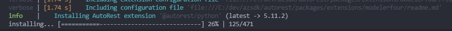

# Novemeber 2021 Release - Autorest Core 3.7.0, Modelerfour 4.22.0

Changelogs for full details:

- [Autorest Core](https://github.com/Azure/autorest/blob/main/packages/extensions/core/CHANGELOG.md)
- [Modelerfour](https://github.com/Azure/autorest/blob/main/packages/extensions/modelerfour/CHANGELOG.md)

## Extension installation progress

Version 3.7.0 of Autorest Core comes with some improvements to the experience by showing a progress bar when it needs to install extensions. Certain extensions would be relatively slow to install and it could let to believe that autorest was stuck on install as no feedback was sent during install.

## Improved error reporting when extensionn install fails

Previous version of autorest core resolved many cases where extension would fail to install for various reasons. There is however still some scenarios where autorest can't solve the problem itself(A bad installation of python preventing @autorest/python to be installed)

This version will now display nicely the inner log from the installation in case of a failure

