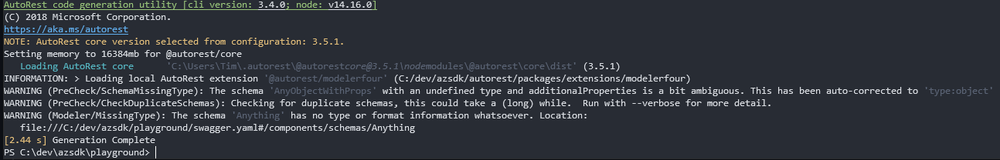
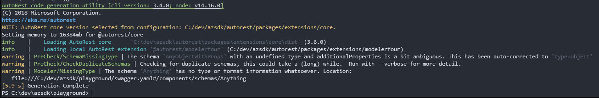

# September 2021 Release - Autorest Core 3.6.0, Modelerfour 4.21.0

Changelogs for full details:

- [Autorest Core](https://github.com/Azure/autorest/blob/main/packages/extensions/core/CHANGELOG.md)
- [Modelerfour](https://github.com/Azure/autorest/blob/main/packages/extensions/modelerfour/CHANGELOG.md)

## Performance improvments

The latest version of autorest core and modelerfour have seen a large focus on performance.
With this latest release we now have quite a significant result for large OpenAPI specifications.

Here is a small benchmark of the progress made over the recent version and what this release brings(Number in seconds).

| Service | Core: 3.3.2 M4: 4.18.4 | Core: 3.4.5 M4: 4.19.3 | Core: 3.5.1 M4: 4.20.0 | Core: 3.5.1 M4: 4.20.0 (with --skip-sourcemap) | Core: 3.6.x M4: 4.21.x |
| ------- | ---------------------- | ---------------------- | ---------------------- | ---------------------------------------------- | ---------------------- |
| Web     | 58                     | 51.5                   | 89.93                  | 46                                             | 26                     |
| Network | 76                     | 66                     | 113.3                  | 60                                             | 35                     |
| SQL     | 108                    | 61                     | 86                     | 54                                             | 33                     |
| MsGraph | Out of memory          | Out of memory          | -                      | 5025                                           | 600                    |

Overall we can see large Azure specs recieve a 2-3x speed increase while Ms Graph which is the largest spec by far(500k lines) achieve nearly 10x speed up.

## Sourcemaps and tracing error original sources

One major bottleneck in the performance was logic related to the sourcemap creation. Sourcemap used to be disabled in previous autorest core version due to its inefficency and was reintroduced in `3.3.0` but only now really addressed the performance issue that came with it. Without sourcemaps when an error occured in autorest the stacktrace woudl present you with an intermediate in-memory file position which didn't was meaningless or confusing.

With this complete redesign of how sourcemaps works in the autorest pipeline there is now a fast sourcemap creation and consumption which lets errors be traced back to the original location in the swagger specs or autorest configuration.

## Logging redesign

This is mostly an internal change to how autorest present the user with information.
It will log information in a cleaner and more consistent maner.

| Before                          | After                          |
| ------------------------------- | ------------------------------ |
|  |  |
